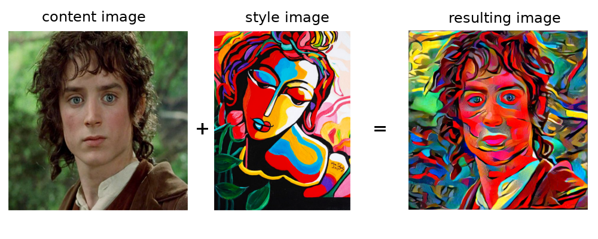
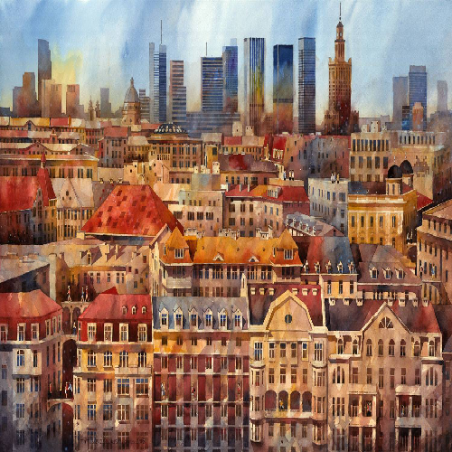
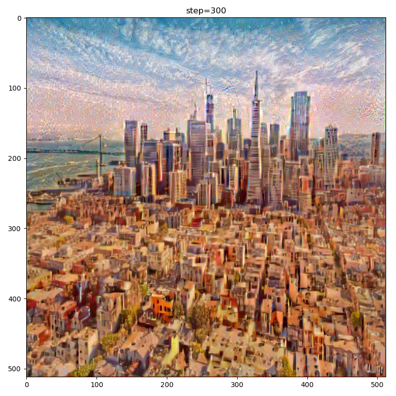
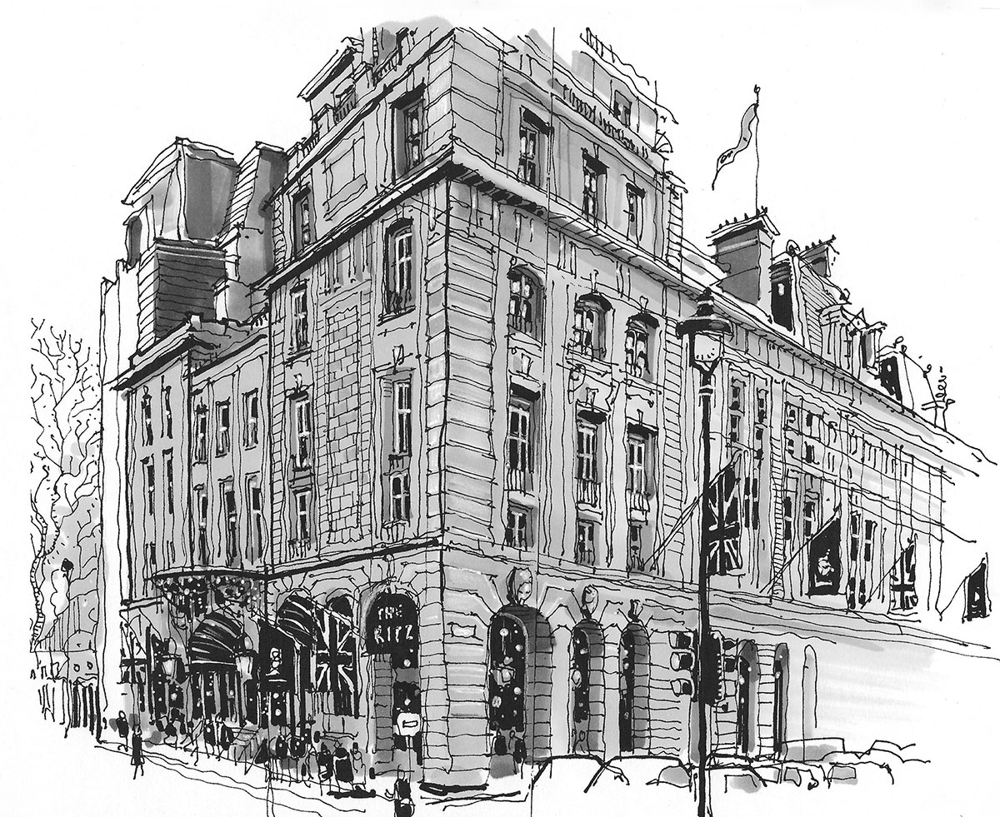
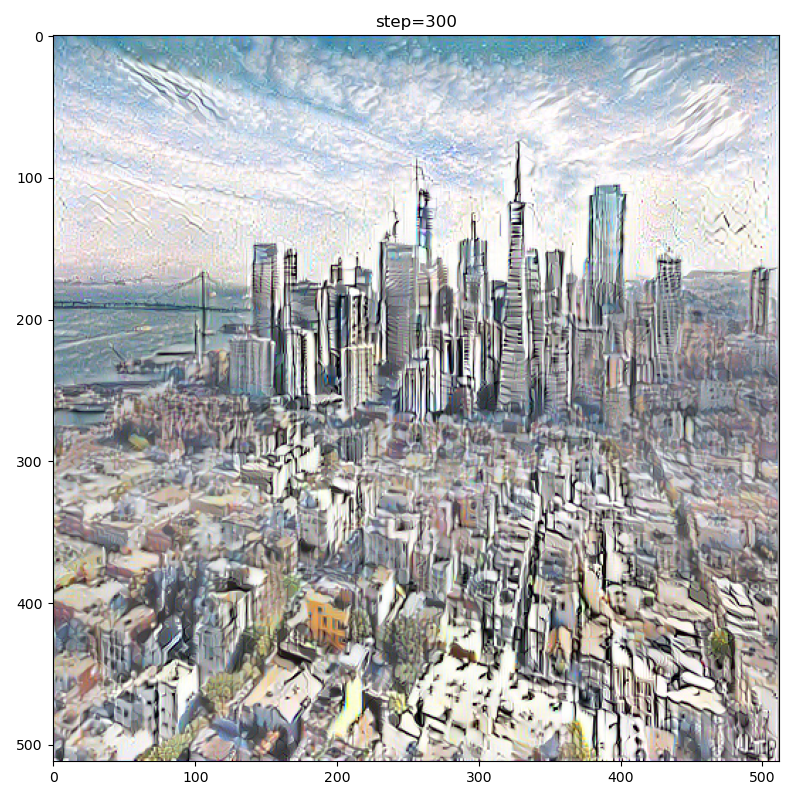
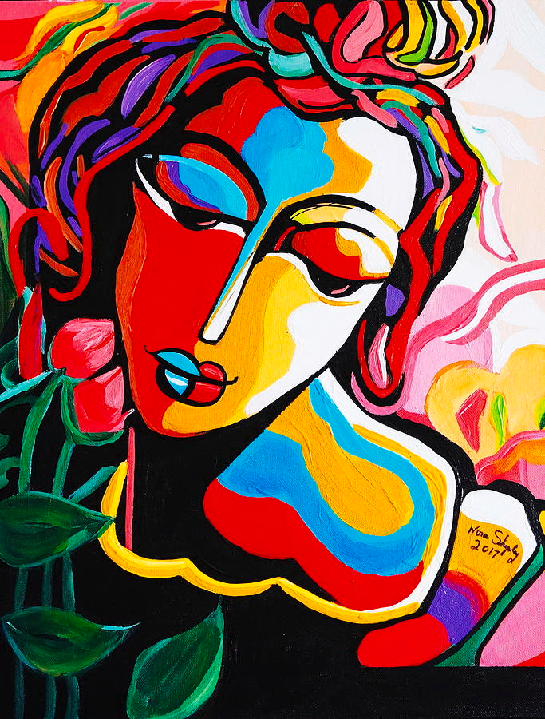
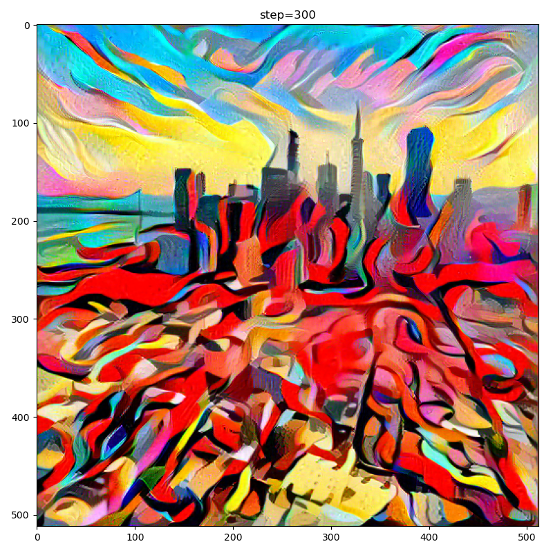

# About

This is a simple implementation of style transfer as presented by [Gatys et al](https://arxiv.org/pdf/1508.06576.pdf). It was coded from scratch and is very similar but not equal to the [implementation by Gatys on github](https://github.com/leongatys/PytorchNeuralStyleTransfer), which I later discovered. Next: Style transfer using (cycle) GANs.

### Problem

- Given a content image (e.g. photograph) and a style image (e.g. artistic painting), how would the content image look like with the style of the style image?

### Solution approach

- Iteratively optimize a new image such that the following losses are minimized
  - content reconstruction loss: L2 difference between late feature values of the new image and of the content image
  - style reconstruction loss: L2 difference between the Gram-matrix of several feature values of the new image and of the style image
  - regularization loss: spatial smoothness (here as dimg/dx+dimg/dy)

### Results

| content img            | style img            | result                |
| ---------------------- | -------------------- | --------------------- |
|  |  |  |
|  |  |  |
|  |  |  |

### Lessons learned

  - The choice of network is very important. This method works very well for the VGG network, but not so well for e.g. MobileNet.
  - The choice of style image is also important. Colorful expressive image yield more impressive results than black and white sketches
  - The choice of the starting image is important. You can either start from the content image or a randomized noise image. While it is possible to get meaningful results in both cases, using the content image usually leads to more eye-pleasing results and more robustness to the weights in the loss term.
  - The outcome is very sensitive to the  weighing of the different loss terms.
  - Gram-matrix: This matrix represents the correlation between different feature channels / filter responses. More specifically, according to [Johnson et al.](https://arxiv.org/pdf/1603.08155.pdf), it is proportional to the uncentered covariance of the feature channels
  - Hooks are a nice tool if you want to extract intermediate inputs/outputs of a network
    - https://www.kaggle.com/sironghuang/understanding-pytorch-hooks
    - https://blog.paperspace.com/pytorch-hooks-gradient-clipping-debugging/
    - https://towardsdatascience.com/the-one-pytorch-trick-which-you-should-know-2d5e9c1da2ca 

### Sources

- [Paper by Gatys](https://arxiv.org/pdf/1508.06576.pdf)
- [Paper by Johnson about Perceptual Loss](https://arxiv.org/pdf/1603.08155.pdf)
- [Tutorial on towards datascience (unfortunately incomplete code)](https://towardsdatascience.com/style-transfer-styling-images-with-convolutional-neural-networks-7d215b58f461)
- [Another very decent tutorial on towards datascience](https://towardsdatascience.com/breaking-down-leon-gatys-neural-style-transfer-in-pytorch-faf9f0eb79db)
- [Original github repo by Gatys](https://github.com/leongatys/PytorchNeuralStyleTransfer)
- [3rd party github repo implementing Gatys and another style transfer method](https://github.com/rrmina/neural-style-pytorch)
- [Style transfer on pytorch.org](https://pytorch.org/tutorials/advanced/neural_style_tutorial.html)

